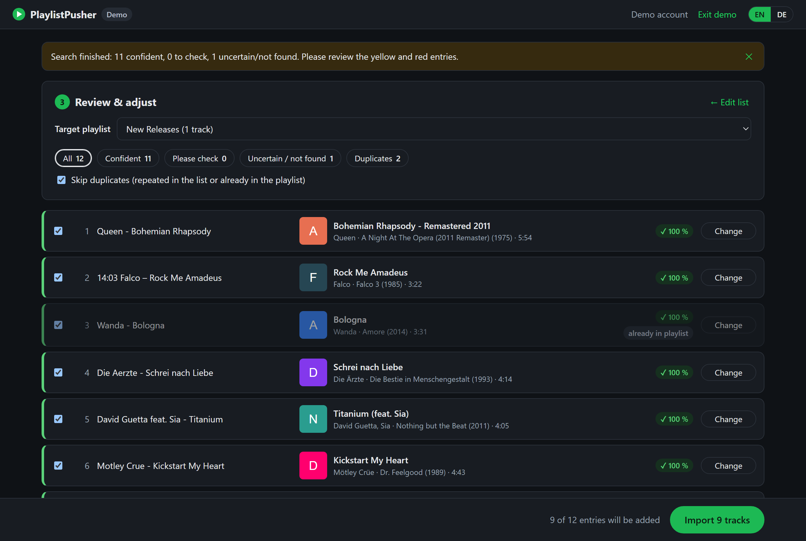

# PlaylistPusher

**Import a track list into a Spotify playlist – and review every match before anything is added.**

[Deutsche Version](README.de.md)



PlaylistPusher is a small local web app for radio stations, DJs and anyone with track lists (playout logs, setlists, CSV exports) that should end up in a Spotify playlist:

1. Paste a list or open a file, then choose the target playlist (or create a new one)
2. Every entry is searched on Spotify – matches appear **live**, color-coded by confidence
3. Fix wrong matches per track: pick an alternative, search again, paste a Spotify link, listen, or skip – and change the order by drag and drop
4. Tracks are added only after you **confirm** the import

The interface is available in **English and German** (switch in the top right corner).

> PlaylistPusher is an independent project and is not affiliated with or endorsed by Spotify.

## Features

- **Flexible input:** "Artist – Title" lines (also with timestamps or numbering), CSV/TSV with a header row, columns copied from Excel, M3U/M3U8, Spotify links, ISRC codes
- **Copes with messy lists:** broken umlauts, underscores instead of spaces, track numbers and durations are cleaned up automatically
- **Reliable matching:** alternative spellings and umlauts, "feat." credits, swapped artist/title order, radio edit vs. album version; karaoke, tribute and unrequested live versions are ranked down
- **Duplicate detection** within the list and against the target playlist
- **Your order:** drag and drop entries to decide in which order they are added
- **Respects Spotify's limits:** paced requests, cancel and resume at any time, request statistics
- **Nothing gets lost:** your review is saved in the browser and restored after a reload or a new login
- **Runs locally:** no packages to install, no cloud service – Python serves the UI, your browser talks directly to the Spotify Web API
- **Demo mode** to try everything without a Spotify account

## Requirements

- **Python 3.9 or newer** (no additional packages)
- A current web browser (Chrome, Edge, Firefox or Safari 15.4+)
- A Spotify account and your own Spotify app (free, see [Setup](#3-create-a-spotify-app-once))

> **Spotify's rules for apps in Development Mode:** the owner of the Spotify app needs **Spotify Premium**. Up to 5 other Spotify accounts can be allowed to use the app under *User Management*.

## Installation

### 1. Download PlaylistPusher

Download the repository via **Code → Download ZIP** and extract it, or clone it with git.

### 2. Install Python (if needed)

Check with `python --version` (Windows) or `python3 --version` (macOS/Linux).

- **Windows:** install from [python.org](https://www.python.org/downloads/) and tick *Add python.exe to PATH* – or run `winget install Python.Python.3.12`
- **macOS:** install from [python.org](https://www.python.org/downloads/) or with Homebrew: `brew install python`
- **Linux:** usually preinstalled; otherwise install `python3` with your package manager

### 3. Create a Spotify app (once)

1. Open the [Spotify Developer Dashboard](https://developer.spotify.com/dashboard) and log in
2. Click **Create app** – name and description are up to you
3. Under **Redirect URIs**, add exactly:
   ```
   http://127.0.0.1:8138/callback
   ```
   (Spotify does not accept `localhost` here.)
4. Under *Which API/SDKs are you planning to use?*, tick **Web API**, agree to the terms and save
5. Open the app settings and copy the **Client ID**
6. Optional: add other Spotify accounts that should use the app under **User Management**

### 4. Start

- **Windows:** double-click `PlaylistPusher.cmd`
- **macOS/Linux:** run `python3 playlistpusher.py` in the project folder

Your browser opens `http://127.0.0.1:8138`. Paste the Client ID, log in with Spotify – done.
Keep the console window open while you use PlaylistPusher; press Ctrl+C or close the window to stop it.

## Usage

1. **Track list** – paste it, click *Open file…* or drag a file into the window
2. **Target playlist** – choose one of your playlists next to the list, or *+ Create new playlist*. Only playlists you own or collaborate on can be filled.
3. **Find tracks** – results appear while the search is running. *Cancel search* stops it, *Resume search* continues later. The target playlist can still be changed at the top of the review screen.
4. **Review** – green: confident (≥ 85 %) · yellow: please check (60–85 %) · red: uncertain or not found (< 60 %, not selected automatically)
5. **Change** – opens alternatives, a search field, a field for a Spotify link, a player (*▶ Listen*) and *Don't import this entry*
6. **Order** – drag an entry by its handle ⠿ to change the order in which the tracks are added. With the handle selected, the arrow keys, Page Up/Down and Home/End move the entry as well. *Restore original order* undoes all moves.
7. **Import** – shows a summary; tracks are added only after you confirm

### Command line

```bash
python playlistpusher.py tracks.txt
python playlistpusher.py tracks.txt "Morning Show"
python playlistpusher.py tracks.csv "New Playlist" --order title-artist
```

With a list **and** a playlist, the search starts right away. The playlist can be given as name, link or ID; if no playlist with that name exists, a new private playlist is created on import. On Windows you can also drag a list file onto `PlaylistPusher.cmd`.

| Option | Description |
|---|---|
| `--order auto\|artist-title\|title-artist` | Order of artist and title in the list (default: `auto`) |
| `--port 8138` | Port of the local UI – must match the redirect URI of your Spotify app |
| `--no-browser` | Do not open the browser automatically |

### Supported list formats

| Format | Example |
|---|---|
| One track per line | `Queen - Bohemian Rhapsody` (separators `-`, `–`, `—`, `\|`, ` / `) |
| With time, date or number in front | `14:03:22 Falco – Rock Me Amadeus`, `12. Wanda - Bologna`, `01 Wanda - Bologna` |
| Title – Artist | detected automatically, or set under *Order* |
| CSV/TSV with header | columns `Artist`/`Interpret`, `Title`/`Track`/`Song`/`Titel`, optional `Album`, `Duration`, `ISRC`, `Spotify URI` (compatible with Exportify exports) |
| Columns copied from Excel | select artist and title columns, copy, paste |
| M3U / M3U8 | `#EXTINF` lines or file names like `01 - Artist - Title.mp3` |
| Spotify links and ISRC | `https://open.spotify.com/track/…`, `spotify:track:…`, `USRC17607839` |

Empty lines and lines starting with `#` or `//` are ignored. UTF-8, UTF-16 and Windows-1252 (ANSI) files are detected automatically.

Messy lines are cleaned up before searching: broken umlauts such as `ä` become `ä`, underscores count as spaces (`Queen_-_Bohemian_Rhapsody`), and durations at the end of a line (`3:55`) are ignored. Lines without a recognizable separator are searched as free text.

### Demo

Open `http://127.0.0.1:8138/?demo` (or use the demo link on the setup page) to try PlaylistPusher with a small sample catalog. The demo does not access Spotify and changes nothing.

## Spotify request limits

Spotify limits the number of requests for apps in Development Mode; the limit is shared by all Development Mode apps of your Spotify developer account and Spotify does not publish its size or reset time. PlaylistPusher therefore searches one entry at a time, spreads its requests out and needs only one or two searches per entry.

- **Cancel search** stops the search immediately; the results found so far are kept.
- If Spotify's limit is reached, the search stops by itself and keeps its results.
- **Resume search** continues with the remaining entries (and retries searches that failed) whenever you like.
- The review screen shows how many requests were sent – since the page was loaded, in the last hour and in the last 24 hours – and when Spotify last reported the quota as used up. This helps to find out the limits for your account.

Tip for long lists: choose *+ Create new playlist* as the target. Reading the tracks of an existing playlist (for the duplicate check) needs one request per 50 tracks.

## Troubleshooting

| Problem | Solution |
|---|---|
| *Port 8138 is already in use* | PlaylistPusher is already running in another window – close it. Or start with `--port 8139` and add `http://127.0.0.1:8139/callback` as an additional redirect URI in your Spotify app. |
| Spotify shows *INVALID_CLIENT: Invalid redirect URI* | The redirect URI in your Spotify app must be exactly `http://127.0.0.1:8138/callback`. |
| *The request quota of your Spotify app is used up* | Spotify's request limit is reached (see above). Wait a while, then click *Resume search*. |
| *Spotify is rejecting requests because too many were sent in a short time* | Wait a minute, then click *Resume search*. |
| *Access denied (403): Insufficient client scope* | Log out, log in again and make sure you use the latest version of PlaylistPusher. |
| *Access denied (403)* | Add the Spotify account under *User Management* in your Spotify app; the app owner needs Premium. |
| *Your Spotify session has expired* | Log in again (Spotify requires this at least every 6 months). Your list is kept. |
| *Your progress could not be saved in the browser* | The list is too large for the browser storage. Keep the tab open until the import is done. |

Error messages name the step that failed (e.g. *Search: …* or *Loading playlists: …*). Details of failed requests are also written to the browser console (F12).

## Privacy

- The local server only listens on `127.0.0.1` and is not reachable from other computers.
- Login uses OAuth with PKCE – no client secret is needed or stored.
- Access tokens, your review progress and the request statistics are stored only in your browser (localStorage of `http://127.0.0.1:8138`); tokens are sent only to Spotify.

## Development

```
playlistpusher.py      local web server (Python standard library only)
PlaylistPusher.cmd     Windows launcher
web/index.html         UI markup
web/style.css          styles (light and dark mode)
web/js/app.js          flow: setup, login, list, matching, import
web/js/review.js       review screen, reordering
web/js/match.js        search strategy and scoring
web/js/parse.js        list parser
web/js/spotify.js      Spotify Web API client (PKCE, pacing, retries, request statistics)
web/js/i18n.js         English and German texts
web/js/demo.js         demo catalog
tests/                 unit tests for parser and matching
```

Run the tests with Node.js 20 or newer:

```bash
npm test
```

## License

[MIT](LICENSE)
